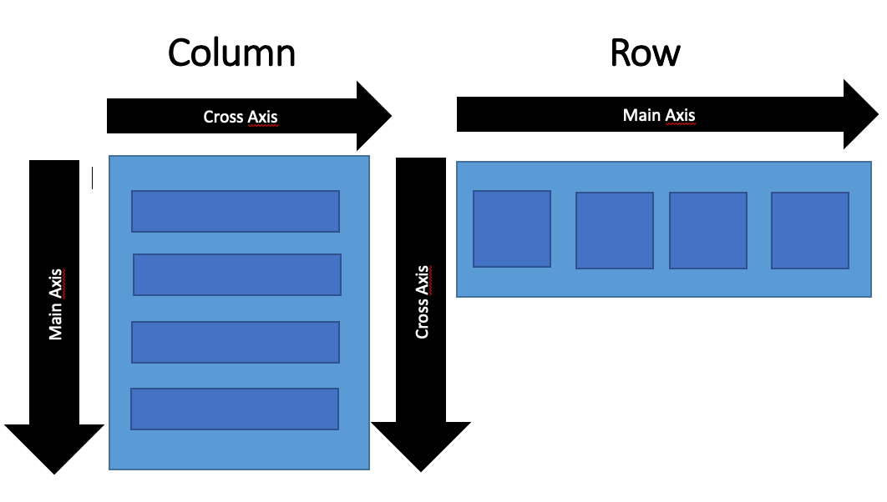

# Platform-Based Programming: Individual Assignment with Flutter

| NAME               | ID         | PBP CLASS |
| ------------------ | ---------- | --------- |
| Sultan Ibnu Mansiz | 2306275840 | D         |

Pada tugas ini, saya membuat suatu projek aplikasi mobile e-commerce sederhana bernama "Second Chapters <3" dengan ide menjual buku-buku bekas. Saya menggunakan framework Flutter untuk membangun dan mengembangkan projek ini.

# Assignment 9: Django Web Service Integration with Flutter App

## _Checklist_ Tugas

- [x] Memastikan _deployment_ proyek tugas Django kamu telah berjalan dengan baik.

- [x] Mengimplementasikan fitur registrasi akun pada proyek tugas Flutter.

- [x] Membuat halaman login pada proyek tugas Flutter.

- [x] Mengintegrasikan sistem autentikasi Django dengan proyek tugas Flutter.

- [x] Membuat model kustom sesuai dengan proyek aplikasi Django.

- [x] Membuat halaman yang berisi daftar semua item yang terdapat pada _endpoint_ `JSON` di Django yang telah kamu _deploy_.

  - [x] Tampilkan _name_, _price_, dan _description_ dari masing-masing item pada halaman ini.

- [x] Membuat halaman detail untuk setiap item yang terdapat pada halaman daftar Item.

  - [x] Halaman ini dapat diakses dengan menekan salah satu item pada halaman daftar Item.

  - [x] Tampilkan seluruh atribut pada model item kamu pada halaman ini.

  - [x] Tambahkan tombol untuk kembali ke halaman daftar item.

- [x] Melakukan filter pada halaman daftar item dengan hanya menampilkan item yang terasosiasi dengan pengguna yang login.

- [x] Menjawab beberapa pertanyaan berikut pada `README.md` pada _root_ folder (silakan modifikasi `README.md` yang telah kamu buat sebelumnya; tambahkan subjudul untuk setiap tugas).

### Jelaskan mengapa kita perlu membuat model untuk melakukan pengambilan ataupun pengiriman data `JSON`? Apakah akan terjadi _error_ jika kita tidak membuat model terlebih dahulu?

Model itu penting buat menjaga data tetap rapi dan konsisten. Selain itu, model juga otomatis ngecek validasi data, jadi lebih gampang buat dirawat. Dengan model, kita bisa menghindari _error_, seperti parsing yang salah atau _field_ yang kelupaan.

### Jelaskan fungsi dari library `http` yang sudah kamu implementasikan pada tugas ini

Library `http` dipakai untuk melakukan permintaan `HTTP` seperti `GET` atau `POST`, mengelola pengiriman dan penerimaan data dalam format `JSON`, serta menangani autentikasi lewat _header_.

### Jelaskan fungsi dari `CookieRequest` dan jelaskan mengapa _instance_ `CookieRequest` perlu untuk dibagikan ke semua komponen di aplikasi Flutter.

`CookieRequest` digunakan untuk mengelola cookies secara otomatis dalam autentikasi berbasis sesi. Ini memastikan sesi tetap konsisten di setiap permintaan, mempermudah pengelolaan autentikasi, dan membuat aplikasi lebih efisien. Dengan membagikan `CookieRequest`, kita bisa menjaga autentikasi tetap stabil tanpa perlu membuat instance baru, sehingga pengelolaannya jadi lebih simpel di seluruh aplikasi.

### Jelaskan mekanisme pengiriman data mulai dari input hingga dapat ditampilkan pada Flutter.

Prosesnya dimulai saat pengguna memasukkan data lewat aplikasi Flutter. Data ini lalu diubah jadi format `JSON` biar gampang dikirim ke _backend_. Flutter pakai `HTTP` buat ngirim data itu ke _server_, di mana _backend_ mengolah untuk simpan ke database atau menjalankan logika tertentu. Setelah selesai, _server_ akan ngirim respons balik, biasanya dalam format `JSON`. Flutter nerima respons ini, ngolah datanya, dan memperbarui tampilan di aplikasi biar pengguna bisa lihat hasil input mereka atau info lain yang dibutuhkan.

### Jelaskan mekanisme autentikasi dari _login_, _register_, hingga _logout_. Mulai dari input data akun pada Flutter ke Django hingga selesainya proses autentikasi oleh Django dan tampilnya menu pada Flutter.

Proses autentikasi dimulai ketika data akun dari Flutter dikirim ke _backend_ Django. Django memvalidasi data tersebut, baik untuk _login_ (dengan membuat _session_) atau _register_ (dengan menyimpan data pengguna baru). Setelah validasi selesai, Django mengirimkan respons kembali ke Flutter, seperti status autentikasi atau pesan tertentu. Flutter kemudian memproses respons ini dan memperbarui UI sesuai dengan status autentikasi, misalnya menampilkan menu utama jika login berhasil atau pesan error jika ada kesalahan.

### Jelaskan bagaimana cara kamu mengimplementasikan _checklist_ di atas secara _step-by-step!_ (bukan hanya sekadar mengikuti tutorial).

- Implementasi fitur registrasi, login, dan integrasi autentikasi pada projek Django untuk Flutter

  Saya melakukan setup autentikasi pada projek Django yang sebelumnya saya buat denga membuat aplikasi baru beranama `authentication`. lalu pada `views.py` di aplikasi `authentication`, saya menambahkan metode _view_ untuk mengakses tampilan _register_ dan _login_. Setelah saya membuat metode _view_, saya melakukan routing di `urls.py` terhadap kedua metode yang saya buat. Lalu, pada direkotori `screens`yang berada di projek Flutter saya, saya membuat dua buah file baru, yaitu `login.dart` dan `register.dart`.

- Membuat model kustom yang sesuai dengan projek Django

  Untuk membuat model kustom yang sesuai dengan proyek Django, ambil data `JSON` dari proyek tersebut dan buka website `QuickType`. Pilih bahasa Dart dan beri nama Model yang sesuai dengan kebutuhan. Setelah itu, salin hasil konversi dari QuickType dan tempelkan ke dalam file di folder models di projek Flutter.

- Membuat halaman yang berisi daftar semua item yang terdapat pada _endpoint_ `JSON` di Django yang telah kamu _deploy_.

  Ambil semua data `JSON` yang dimiliki oleh pengguna (yang sudah diimplementasikan di Django), kemudian simpan data tersebut ke dalam sebuah list untuk memudahkan pengolahan atau penampilannya. Setelah dikumpulkan ke dalam list, tampilkan data-data tersebut dengan ListView.

- Membuat halaman detail untuk setiap item yang terdapat pada halaman daftar Item.

  Saya tiap item pada halaman yang menampilkan seluruh data dapat dipencet dan akan mengarahkan ke halaman baru yang akan menampilkan informasi mengenai item yang dipencet tersebut. Halaman yang saya buat saya berikan nama `product_info.dart` dan saya letakkan di dalam direkotori `screens`.

- Melakukan filter pada halaman daftar item dengan hanya menampilkan item yang terasosiasi dengan pengguna yang _login_.

  Sudah dilakukan pada implementasi django.

- [x] Melakukan `add`-`commit`-`push` ke GitHub.


# Assignment 8: Flutter Navigation, Layouts, Forms, and Input Elements

## _Checklist_ Tugas

- [x] Membuat minimal satu halaman baru pada aplikasi, yaitu halaman formulir tambah item baru dengan ketentuan sebagai berikut:

  - [x] Memakai minimal tiga elemen input, yaitu `name`, `amount`, `description`. Tambahkan elemen input sesuai dengan model pada aplikasi tugas Django yang telah kamu buat.

  - [x] Memiliki sebuah tombol `Save`.

  - [x] Setiap elemen input di formulir juga harus divalidasi dengan ketentuan sebagai berikut:

    - [x] Setiap elemen input tidak boleh kosong.

    - [x] Setiap elemen input harus berisi data dengan tipe data atribut modelnya.

 - [x] Mengarahkan pengguna ke halaman form tambah item baru ketika menekan tombol `Tambah Item` pada halaman utama.

 - [x] Memunculkan data sesuai isi dari formulir yang diisi dalam sebuah `pop-up` setelah menekan tombol `Save` pada halaman formulir tambah item baru.

 - [x] Membuat sebuah drawer pada aplikasi dengan ketentuan sebagai berikut:

  - [x] Drawer minimal memiliki dua buah opsi, yaitu `Halaman Utama` dan `Tambah Item`.

  - [x] Ketika memiih opsi `Halaman Utama`, maka aplikasi akan mengarahkan pengguna ke halaman utama.

  - [x] Ketika memiih opsi `Tambah Item`, maka aplikasi akan mengarahkan pengguna ke halaman form tambah item baru.

- [x] Menjawab beberapa pertanyaan berikut pada `README.md` pada _root_ folder (silakan modifikasi `README.md` yang telah kamu buat sebelumnya; tambahkan subjudul untuk setiap tugas).

### Apa kegunaan `const` di Flutter? Jelaskan apa keuntungan ketika menggunakan `const` pada kode Flutter. Kapan sebaiknya kita menggunakan `const`, dan kapan sebaiknya tidak digunakan?

Kegunaan `const` di Flutter adalah untuk mendeklarasikan data yang tidak berubah-ubah. Lebih lanjut, nilai pada variabel `const` ditentukan pada saat sebelum program dijalankan dan tidak dapat menerima data saat _runtime_. Salah satu keuntungan penggunaan `const` adalah untuk mengoptimalan performa dan efisiensi memori karena program tidak perlu merender ulang _widget_ yang ditandai sebagai `const` ketika ada perubahan di _route_ yang memengaruhi _widget_ tersebut.
- Kapan sebaiknya menggunakan `const`?

  Ketika kita tahu nilai dari suatu _widget_ tidak akan berubah saat _runtime_.
  ```dart
    child: const Column(
      children: [
        ...
      ]
    )
  ```
  Nilai `const` di atas diambil dari _widget_ `LeftDrawer` yang menampilkan sesuatu yang konstan dan tidak akan berubah.

- Kapan sebaiknya tidak menggunakan `const`?

  Jangan gunakan `const` pada _widget_ yang variabel datanya dapat berubah saat _runtime_, salah satu contohnya adalah variabel dari _user input_.
  ```dart
    ...
    children: [
      Text('Title: $_title'),
      Text('Author: $_author'),
      Text('Price: $_price'),
      Text('Description: $_desc'),
    ],
    ...
  ```
  Variabel-variabel di atas dapat berubah sesuai apa yang diinput oleh _user_.

### Jelaskan dan bandingkan penggunaan _Column_ dan _Row_ pada Flutter. Berikan contoh implementasi dari masing-masing _layout widget_ ini!



_Courtesy of_ [https://medium.com/@apmntechdev/flutter-column-and-row-e1f35b419690](https://medium.com/@apmntechdev/flutter-column-and-row-e1f35b419690)

Pada Flutter, _Column_ dan _Row_ adalah dua _widget layout_ yang sering digunakan untuk menata elemen-elemen dalam tampilan secara vertikal dan horizontal. Di bawah ini adalah penjelasan singkat tentang keduanya serta contoh implementasinya.

- _Column_

Menyusun _widget child_ secara vertikal dari atas ke bawah. Biasanya digunakan saat ingin menampilkan item atau elemen dalam urutan vertikal, seperti daftar, _form input_, atau informasi yang berurutan.

- _Row_

Menyusun _widget child_ secara horizontal dari kiri ke kanan. Biasanya digunakan ketika Anda ingin menampilkan beberapa item dalam baris yang sama, seperti ikon-ikon, tombol-tombol, atau elemen informasi yang berdampingan.

```dart
  ...
  child: Column(
    crossAxisAlignment: CrossAxisAlignment.center,
    children: [
      // Row untuk menampilkan 3 InfoCard secara horizontal.
      Row(
        mainAxisAlignment: MainAxisAlignment.spaceEvenly,
        children: [
          InfoCard(title: 'NPM', content: npm),
          InfoCard(title: 'Name', content: name),
          InfoCard(title: 'Class', content: className),
        ],
      ),
    ...
    ]
  )
```

Kode di atas merupakan implementasi _Column_ dan _Row_ yang saya gunakan di dalam projek Flutter saya yang berada pada _widget_ `MyHomePage`.

###  Sebutkan apa saja elemen _input_ yang kamu gunakan pada halaman _form_ yang kamu buat pada tugas kali ini. Apakah terdapat elemen _input_ Flutter lain yang tidak kamu gunakan pada tugas ini? Jelaskan!

Pada tugas kali ini, saya hanya mengimplementasikan satu tipe elemen _input_, yaitu `TextFormField`. Selain `TextFormField`, ada beberapa elemen _input_ lain, seperti `Checkbox` yang memungkinkan pengguna untuk memilih satu opsi dari beberapa pilihan, `Slider` yang memungkinkan pengguna memilih nilai dari rentang tertentu, dsb.

### Bagaimana cara kamu mengatur tema (_theme_) dalam aplikasi Flutter agar aplikasi yang dibuat konsisten? Apakah kamu mengimplementasikan tema pada aplikasi yang kamu buat?

Cara saya mengatur tema dalam mengembangkan aplikasi Flutter saya adalah dengan menyesuaikan apa yang telah saya buat sebelumnya pada projek Django. Untuk membuat aplikasi Flutter yang konsisten, kita perlu menyesuaikan komponen-komponen tampilan, seperti teks, warna, icon, dan tombol agar sesuai dengan tema yang kita bawa.

### Bagaimana cara kamu menangani navigasi dalam aplikasi dengan banyak halaman pada Flutter?

Pertama, saya membuat sebuah direktori baru bernama `screens` khusus untuk menyimpan file-file yang sekiranya akan ditampilkan pada aplikasi. Untuk melakukan navigasi perpindahan dari satu halaman ke halaman yang lain, saya menggunakan fungsi `push()`, `pop()`, dan `pushReplacement()` yang diimplementasikan pada sebuah ikon ataupun tombol sebagai _event handler_.

Contoh, saya mempunyai sebuah _widget_ bernama `MyHomePage` pada file `menu.dart` yang dapat diakses ketika _user_ memencet ikon yang ada pada _drawer_.

```dart

  ListTile(
    leading: const Icon(Icons.home_outlined),
    title: const Text('Halaman Utama'),
    // Bagian redirection ke MyHomePage
    onTap: () {
      Navigator.pushReplacement(
          context,
          MaterialPageRoute(
            builder: (context) => MyHomePage(),
          ));
    },
  ),

```
Ketika ikon ataupun teks di atas dipencet, tampilan akan berubah menjadi halaman _widget_ `MyHomePage()` dengan menggunakan fungsi `pushReplacement()`sebagai navigasi ke halaman baru.

- [x] Melakukan `add`-`commit`-`push` ke GitHub.


# Assignment 7: Flutter Basic Elements

## _Checklist_ Tugas

- [x] Membuat sebuah program Flutter baru dengan tema _E-Commerce_ yang sesuai dengan tugas-tugas sebelumnya.

- [x] Membuat tiga tombol sederhana dengan ikon dan teks untuk:

  - [x] Melihat daftar produk (`Lihat Daftar Produk)`)

  - [x] Menambah produk (`Tambah Produk`)

  - [x] Logout (`Logout`)

- [x] Mengimplementasikan warna-warna yang berbeda untuk setiap tombol (`Lihat Daftar Produk`, `Tambah Produk`, dan `Logout`).

- [x] Memunculkan `Snackbar` dengan tulisan:

  - [x] "Kamu telah menekan tombol Lihat Daftar Produk" ketika tombol `Lihat Daftar Produk` ditekan.

  - [x] "Kamu telah menekan tombol Tambah Produk" ketika tombol `Tambah Produk` ditekan.

  - [x] "Kamu telah menekan tombol Logout" ketika tombol `Logout` ditekan.

- [x] Menjawab beberapa pertanyaan berikut pada `README.md` pada _root folder_.

### Jelaskan apa yang dimaksud dengan _Stateless Widget_ dan _Stateful Widget_, dan jelaskan perbedaan dari keduanya!
- _Stateless Widget_
    
    _Stateless Widget_ adalah jenis _widget_ yang tidak berubah dari state internal yang dapat berubah seiring waktu. Artinya, tampilan dari _widget_ ini akan tetap sama setelah pertama kali dibangun. _Stateless Widget_ hanya memiliki properti _final_ yang akan ditampilkan di layar. Pada tugas kali ini, saya menggunakan _Stateless Widget_ untuk membuat kelas `InfoCard` dan `ItemCard` yang mana kedua kelas tersebut menampilkan _widget_ yang statis dan tidak akan berubah.

- _Stateful Widget_

    _Stateful Widget_ adalah jenis _widget_ yang memiliki state internal yang dapat berubah seiring waktu. Perubahan pada state akan menyebabkan _widget_ tersebut membangun ulang atau merubah tampilannya.

Salah satu perbedaan utama antara _Stateless Widget_ dan _Stateful Widget_ adalah dalam hal menampilkan _widget_ pada aplikasi kita. Gunakan _Stateless Widget_ ketika kita ingin menampilkan _widget_ yang sederhana dan statis, seperti gambar dan teks. Gunakan _Stateful Widget_ ketika kita ingin menampilkan _widget_ yang dapat berubah seiring interaksi dengan user, seperti form dan list.

### Sebutkan _widget_ apa saja yang kamu gunakan pada proyek ini dan jelaskan fungsinya!

Dalam tugas kali ini, saya membuat dua buah _stateless widget_ yang saya implementasikan dalam kelas `InfoCard` dan `ItemCard`. _Widget_ pada kelas `InfoCard` berfungsi untuk menampilkan data diri saya, seperti nama, npm, dan kelas. _Widget_ pada kelas `ItemCard` berfungsi untuk menampilkan tiga buah _button card_. Untuk tugas kali ini, tiga buah _button card_ tersebut hanya berfungsi untuk menampilkan _snackbar_ ketika diklik.

### Apa fungsi dari `setState()`? Jelaskan variabel apa saja yang dapat terdampak dengan fungsi tersebut!

Singkatnya, `setState()` berfungsi untuk memberi tahu _framework_ bahwa ada perubahan pada suatu variabel di dalam _widget_. Perubahan tersebut mengharuskan tampilan untuk diperbarui agar sesuai dengan perubahan data. Variabel-variabel yang terdampak dari fungsi `setState()` di antaranya adalah variabel yang ada di kelas _Stateful Widget_ dan _database_ sesuai dengan perubahan apa yang terjadi (menampilkan data atau menambahkan data).

### Jelaskan perbedaan antara `const` dengan `final`!

`const` dan `final` sama-sama digunakan untuk mendeklarasikan data yang tidak dapat diubah. Perbedaan utama keduanya adalah:

- `const`

    Nilai pada variabel `const` harus ditentukan sebelum program dijalankan dan tidak dapat menerima nilai yang dihasilkan saat _runtime_.
    ```dart
      const pi = 3.14159;
    ```

- `final`

    Nilai pada variabel `final` dapat ditentukan baik saat waktu _runtime_ maupun sebelum. Ketika nilai variabelnya ditentukan, hal tersebut hanya dapat dilakukan sekali dan tidak akan berubah.
    ```dart
      class ItemHomepage {
        // Kedua variabel di bawah akan diinisialisasi saat runtime
        final String name;
        final IconData icon;

        ItemHomepage(this.name, this.icon);
      }
    ```


###  Jelaskan bagaimana cara kamu mengimplementasikan _checklist-checklist_ di atas!

- Pertama, saya membuat projek Flutter baru dengan menjalankan _command_ di bawah.
  ```dart
    flutter create pre_loved_books
  ```

- Untuk membuat tiga tombol sederhana dengan ikon dan teks, saya membuat file baru bernama `menu.dart` yang saya isi dengan kelas benama `ItemCard`. Kelas `ItemCard` akan menerima 2 buah variabel, yaitu `item` yang digunakan untuk menginisialisai nama card dan icon, dan `backgroundColor` sebagai warna untuk masing-masing card yang dibuat.

  ```dart
  class ItemCard extends StatelessWidget {
    // Menampilkan kartu dengan ikon dan nama.
    final ItemHomepage item;
    final Color backgroundColor;

    const ItemCard(this.item, {required this.backgroundColor, super.key});
    ...

  ```

- Untuk mengimplementasikan warna yang berbeda, saya membuat variabel baru yang berisi warna-warna yang akan digunakan, lalu, variabel tersebut akan menginisialisasi kelas `ItemCard`.
  ```dart
  ...

  // Variabel warna 
  final List<Color> itemColors = [
    Colors.blue, 
    Colors.green, 
    Colors.red, 
  ];

  ...

  // Inisialisasi warna
  children: items.asMap().entries.map((entry) {
    int index = entry.key;
    ItemHomepage item = entry.value;

    return ItemCard(item, backgroundColor: itemColors[index]);
  }).toList(),

  ...

  // Menggunakan warna yang telah diinisialisasi
  class ItemCard extends StatelessWidget {
    final ItemHomepage item;
    final Color backgroundColor;

    const ItemCard(this.item, {required this.backgroundColor, super.key});
    @override
    Widget build(BuildContext context) {
      return Material(
        color: backgroundColor,
        ...

      )
    }
  }

  ```

- Untuk memunculkan `snackbar` yang sesuai dengan ketentuan, saya mengimplementasi kode di bawah pada kelas `ItemCard`.
  ```dart
    onTap: () {
      ScaffoldMessenger.of(context)
        ..hideCurrentSnackBar()
        ..showSnackBar(SnackBar(
            content: Text("Kamu telah menekan tombol ${item.name}!")));
    },
  ```

- [x] Melakukan `add`-`commit`-`push` ke suatu repositori baru di GitHub.


